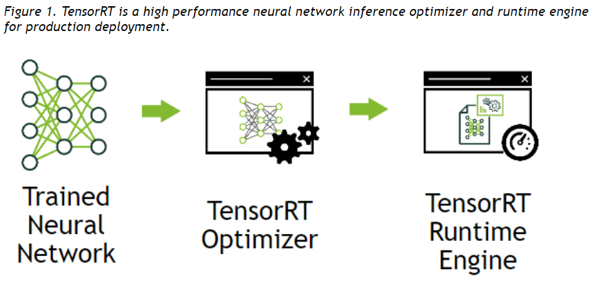

> 以下内容根据个人理解整理而成，如有错误，欢迎指出，不胜感激。
### 0. 写在前面
由于近期的工作需要用到TensorRT和TensorRT Inference Server，自己也是第一次接触，因此在这里记录下相关的学习和使用笔记，内容主要来自于官方相关文档，如[TensorRT Developer Guide](https://docs.nvidia.com/deeplearning/sdk/tensorrt-developer-guide/index.html#c_topics)等。
本文主要记录TensorRT相关的基础知识，主要包括以下几个方面：
* 什么是TensorRT
* TensorRT的工作原理
* TensorRT学习资源总结

### 1. 什么是TensorRT
可以把TensorRT看做一个“深度学习框架”，不同于常用的TensorFlow、PyTorch和Caffe等深度学习框架，TensorRT的目的不是如何训练我们的深度学习模型，而是考虑如何将那些使用其他框架训练好的模型进行高效快速的Inference。

[官方](https://docs.nvidia.com/deeplearning/sdk/tensorrt-developer-guide/index.html#c_topics)的这张图可以很明确的说明TensorRT的作用：用于模型训练完之后的部署阶段，以进行高效低延时的Inference：

要注意，TensorRT是NVIDIA配套其相关GPU提供的，并不支持在CPU和其他GPU上使用。

### 2. TensorRT的工作原理
这里会有疑问：**直接使用TensorFlow和PyTorch等模型进行部署不可以吗？**
这当然是可以的，只是TensorRT是一个专用的Inference工具，使用它进行部署会使模型运行更高效。

TensorRT对一个模型主要进行了以下几点优化(翻译自官方教程)：
* 去除输出没有被使用的层
* 去除那些相当于没用的操作
* 将卷积、偏置和ReLU操作融合在一起
* 聚合那些相似的操作
* 融合残差层
(以上这些操作中有些并不清楚具体实现原理，后面在使用到时再具体学习)

除了上述对模型整体的优化外，在TensorRT中还可以直接设置权值的精度，如可以进行`INT8`或`FP16`精度的运算，默认是`FP32`精度。当然，低精度带来速度提升的同时，必然会带来准确度的损失，在模型部署时可根据需要来权衡。

了解了上述概念，需要考虑下一个问题：**通过其他框架训练好的模型，如何导入到TensorRT中使用？**
TensorRT支持TensorFlow、PyTorch，MXNet和Caffe等主流框架模型的导入，支持方式是通过一些通用的模型交换格式作为中间媒介。

TensorRT中有三个Parser用于模型的导入：
* Caffe Parser: 支持Caffe框架模型的导入
* UFF Parser：通用框架格式(UFF)是描述DNN的执行图的数据格式
* ONNX Parser：通用模型交换格式(ONNX)是一种开放式的文件格式，用于存储训练好的模型

需要清楚的是，各种框架间模型的转换，需要的仅仅是模型的定义及权值。
通过将模型保存为以上三个Parser可以解析的格式，则基本上就可以将模型导入到TensorRT中。

接下来的问题是：**模型如何在TensorRT执行Inference？**
事实上，一个模型从导入到执行，会经过下面三个阶段：
* Network Definition: 这一阶段在TensorRT中定义网络模型，可以使用TensorRT提供的Parser导入已有模型进行定义，也可以使用TensorRT中提供的网络层来编程定义(这一步应该也需要准备好相关的权值)
* Builder：前面提到过，TensorRT会对模型进行优化，这一步就是配置各项优化参数，并能生成可执行Inference的Engine
* Engine：Engine可理解为一个Builder的实例，是我们导入的模型经过Builder的配置所生成的一个优化过的Inference执行器，所有的Inference可直接调用Engine来执行

通过上面的分析可以有这样的理解：一个导入的模型可根据不同的Builder配置来生成不同的Engine来执行Inference(同一个Builder可生成多个Engine？)

一个模型从导入到生成Engine是需要花费一些时间的，因此TensorRT提供了Engine的序列化和反序列化操作，一旦我们确定了一个Engine，可以对其进行序列化操作，下次执行Inference时直接反序列化该Engine即可。

### 3. 其他零碎的东西：
* TensorRT提供了C++接口和Python接口，官方建议使用C++接口
* 一个Engine的建立是根据特定GPU和CUDA版本来的，所以在一个机器上序列化的Engine到另一个机器上不一定能使用，因此在使用Builder生成Engine前，要注意自己的环境配置
* TensorRT可结合DALI(加速数据读取)和DLA(加速某些层的运算)一起使用
* 对于TensorRT中不支持的层，需要自己编写相应的文件，TensorRT提供了相关支持

### 4. TensorRT的获取及相关学习资源
个人认为使用TensorRT最好的方式就是使用其[docker镜像](https://ngc.nvidia.com/catalog/containers/nvidia:tensorrt)，需要以下三个步骤：
* 安装基础[Docker环境](https://buzheng.org/linux/how-to-install-and-use-docker-on-ubuntu-18-04/)
* 安装[nvidia-docker](https://github.com/NVIDIA/nvidia-docker)以使docker容器能够使用GPU
* 获取[TensorRT的docker镜像](https://ngc.nvidia.com/catalog/containers/nvidia:tensorrt)
至此便可以使用TensorRT了。

关于TensorRT的学习资源，个人认为官方的一些文档写的很详细，值得学习，个人的这些Blog也大多数来自官方文档，主要如下：
* [TensorRT安装指南](https://docs.nvidia.com/deeplearning/sdk/tensorrt-install-guide/index.html)，如果是使用docker的话，这里就不需要看
* [TensorRT开发者指南](https://docs.nvidia.com/deeplearning/sdk/tensorrt-developer-guide/index.html)，介绍了TensorRT中的一些原理和概念
* [TensorRT实例教程](https://docs.nvidia.com/deeplearning/sdk/tensorrt-sample-support-guide/index.html)，一些TensorRT中的具体例子，很详细，覆盖的也很广
* [TensorRT官方主页](https://developer.nvidia.com/tensorrt)，包括上述链接的入口
