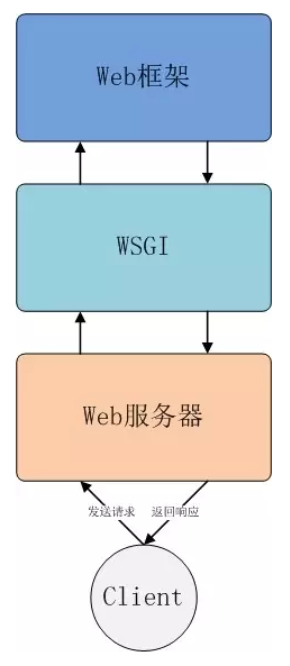
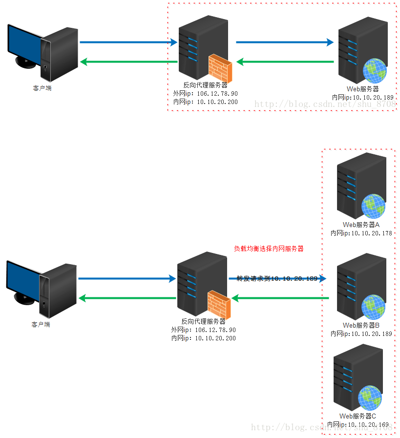

> 以下内容根据个人理解整理而成，如有错误，欢迎指出，不胜感激。
### 0. 写在前面
本文记录自己在服务器上部署python应用的实现过程，涉及的内容如下：
* Flask、nginx和uwsgi之间的关系
* 从零开始使用Flask+nginx+uwsgi+Docker部署一个python应用

### 1. Flask、nginx和uwsgi之间的关系
**客户端向服务器发送一个http请求，一般要经过下面三个阶段：**
* web服务器：用于接收客户端请求，并向客户端返回响应
* web框架：用于对客户端的请求进行相应的处理，web框架也直接调用了我们自己编写的处理程序
* WSGI协议：WSGI全称为`Web Server Gateway Interface`，它定义了web服务器和web框架之间相互交互的接口规范，只要web服务器和web框架满足WSGI协议，那么不同框架和服务器之间就可以任意搭配。要注意的是WSGI只适用于python语言


**理解了上述内容，再来看Flask、nginx和uwsgi就比较简单：**
* nginx就是一个web服务器
* Flask就是一个web框架，常用的其他web框架还有Django
* uwsgi与WSGI一样，是一种通信协议。首先要说明，uWSGI是一个web服务器，它实现了WSGI、uwsgi、http等协议，其作用就是把HTTP协议转化成语言支持的网络协议，用于处理客户端请求，并向客户端返回响应。这里的uwsgi则是uWSGI服务器的独占协议(只适用于uWSGI服务器?)，与WSGI是两种不同的协议

通过上面的描述中可以得出，uWSGI+Flask就可以实现一个完整的web服务，似乎不需要Nginx服务器。
当一个服务访问量过大时，我们可能会考虑多部署几台web服务器，这几台web服务器都可以处理客户端请求，但问题是如何将客户端请求分发到各个web服务器上？这就是Nginx的作用->反向代理服务器。

**正向代理服务器(Proxy Server):**如下图所示，用于代理客户端请求来访问外部网络信息，这种方式可以隐藏客户端真实IP，突破访问限制，保护客户端安全，VPN就是这种原理。


**反向代理服务器(Reverse Proxy Server):**反向代理服务器的功能是代理服务器接收客户端发来的请求，转发到相应的web服务器上进行处理，并将结果返回给客户端，反向代理服务器相当于是代理web服务器而不是客户端。

上图中的web服务器可以视为是uWSGI服务器，而反向代理服务器就相当于是nginx服务器，它具有强大的反向代理和负载均衡功能，可以平衡集群中各个服务器的负载，并且高效稳定。

综上，我们所使用的Flask+nginx+uwsgi部署python应用，客户端的每一次请求都要经过如下流程：


### 2. Docker部署python应用的整体框架
下图是一个简单的示意图，其中外侧粗线框矩形表示我们的服务器，内部各个小矩形分别代表了Flask Docker和Nginx Docker。
通过配置，我们将服务器的80端口映射到Nginx Docker的80端口，Nginx Docker会处理到达80端口的相关http请求。
通过配置，我们开放Flask Docker的8080端口，并配置Nginx Docker将相关的http请求通过8080端口发送到Flask Docker上，具体示意图如下：


以下内容几乎全部来自[Building a Flask app with Docker | Learning Flask Ep. 24](https://pythonise.com/feed/flask/building-a-flask-app-with-docker-compose)，自己按照这篇博客的步骤成功部署了自己的python应用，这里对相关内容进行更加详细的解释。
整个项目的文件结构如下：
```
app
├── docker-compose.yml    # 用于同时编译flask docker和nginx docker
├── flask
│   ├── Dockerfile        # flask docker配置文件
│   ├── .dockerignore     # 生成docker时需要忽略的文件
│   ├── my_app               # python应用， 可在这里扩展自己的python应用
│   │   ├── __init__.py
│   │   └── views.py
│   ├── uwsgi.ini           # uWSGI服务器配置文件
│   ├── requirements.txt  # docker相关依赖
│   └── run.py
├── nginx
│   ├── Dockerfile
│   └── nginx.conf        # nginx服务器相关配置文件
└── readme.md
```

#### 2.1 Flask框架下app工作流程
首先以一个简单的例子解释一下Flask框架下app如何工作
```
# 从flask包中导入Flask类
# Flask用于创建web应用实例
from flask import Flask

# 创建一个web应用实例
# 当我们执行脚本时，__name__变量获得的字符串为'__main__'
app = Flask(__name__)

# 用于响应客户端http请求的函数
# '/'用于响应类似'ip:port'这样的请求
# 还可以定义其他@app.route('/xxx')，用于响应'ip:port/xxx'这样的请求
# route()的作用就是解析http请求中的相关信息
@app.route('/')
def home():
    return "Hey there!"

# app.run()用于启动该web应用实例
# 此时一旦有相关http请求，就会执行相关处理函数
if __name__ == '__main__':
    app.run(debug=True)
```

#### 2.2 各文件内容详解

**首先配置我们的python应用：**
我们把自己的应用目录封装成一个模块包，当该目录被首次导入时，会首先执行`__init__.py`中的代码完成相应的初始化：
`my_app/__init__.py`
```
from flask import Flask

# 实例化一个web应用
app = Flask(__name__)

# 导入views及其他相关模块
from my_app import views
xxx
```

`my_app/views.py`
```
# 这里导入的app就是__init__.py文件中初始化的Flask实例
from my_app import app
import os

# 定义相关处理函数
@app.route("/")
def index():

    # Use os.getenv("key") to get environment variables
    # 此处获取环境变量
    # 相关环境变量配置后面会说
    app_name = os.getenv("APP_NAME")

    if app_name:
        return f"Hello from {app_name} running in a Docker container behind Nginx!"

    return "Hello from Flask"
```

`run.py`
```
# 在执行该语句之前，会执行__init__.py，实例化Flask实例，导入自己的相关应用
from my_app import app

if __name__ == "__main__":
    app.run()
```

以上三个文件中的内容加起来才是2.1节中的内容，这里说一下自己对这么组织程序的理解：
* `views.py`: 我们可以为每一种请求定义一个.py文件， 比如还可以添加`views1.py`、`views2.py`等，它们只需要导入实例化的`app`和相关需要的包即可；
* `__init__.py`: 这里面实例化Flask实例，并导入自己的各种python应用
* `run.py`: 该文件用于和外部的uWSGI交互
这种组织方式使得我们只需要在`my_app/`文件夹下添加自己的应用，并在`__init__.py`中导入即可，每个应用单独一个文件会使得程序更为清晰。

`requirements.txt`
可以使用`python3-venv`来创建虚拟环境，安装需要的依赖来开发应用，最后在虚拟环境中使用`pip freeze > requirements.txt`来生成依赖列表
自己生成的`requirements.txt`中有一项是`pkg-resources==0.0.0`，根据[stack overflow](https://stackoverflow.com/questions/39577984/what-is-pkg-resources-0-0-0-in-output-of-pip-freeze-command)，这应该是ubuntu的一个bug，直接删除该行即可。

**配置uWSGI服务器：**
相关`uwsgi.ini`文件内容如下：
```
[uwsgi]
wsgi-file = run.py         # 指定要加载的WSGI文件，也即包含Flask实例(app)的文件名称
callable = app             # 指出uWSGI加载的模块中哪个变量将被调用， 也即Flask实例名称
socket = :8080             # 指定socket文件，也可以指定为127.0.0.1:9000，用于配置监听特定端口的套接字
processes = 4              # 指定开启的工作进程数量（这里是开启4个进程）
threads = 2                # 设置每个工作进程的线程数
master = true              # 启动主进程，来管理其他进程，其它的uwsgi进程都是这个master进程的子进程
chmod-socket = 660         # unix socket是个文件，所以会受到unix系统的权限限制。如果我们的uwsgi客户端没有权限访问uWSGI socket，可以用这个选项设置unix socket的权限
vacuum = true              # 当服务器退出的时候自动删除unix socket文件和pid文件
die-on-term = true         # ？
buffer-size = 65535        # 设置用于uwsgi包解析的内部缓存区大小为128k。默认是4k
limit-post = 104857600     # 限制http请求体大小
```
更过关于nWSGI相关的内容可参考[这里](https://uwsgi-docs.readthedocs.io/en/latest/)

**配置nginx服务器：**
```
server {

    listen 80;                    # 监听80端口
    charset UTF-8;
    client_max_body_size 30M;
    location / {
        include uwsgi_params;
        uwsgi_pass flask:8080;   # flask指容器名字，该配置是指将信息转发至flask容器的8080端口
    }
}
```

**配置Docker：**
`flask/Dockerfile`
```
# Use the Python3.6 image
# 使用python 3.6作为基础镜像
FROM python:3.6

# Set the working directory to /app
# 设置工作目录，作用是启动容器后直接进入的目录名称
WORKDIR /app

# Copy the current directory contents into the container at /app
# . 表示和Dockerfile同级的目录
# 该句将当前目录下的文件复制到docker镜像的/app目录中
ADD . /app

# Install the dependencies
# 安装相关依赖
RUN pip install -r requirements.txt

# run the command to start uWSGI
# 容器启动后要执行的命令 -> 启动uWSGI服务器
CMD ["uwsgi", "uwsgi.ini"]
```

`nginx/Dockerfile`
```
# Use the Nginx image
# 使用Nginx镜像
FROM nginx

# Remove the default nginx.conf
# 移除官方的配置文件， 并换为自己的
RUN rm /etc/nginx/conf.d/default.conf

# Replace with our own nginx.conf
COPY nginx.conf /etc/nginx/conf.d/
```

**配置docker-compose：**
通过配置docker-compose.yml文件，可以同时build和启动多个容器
```
version: "3.7"

services:

  flask:
    build: ./flask           # 指向相关镜像的Dockerfile所在目录
    container_name: flask
    restart: always
    environment:             # 配置容器的环境变量
      - APP_NAME=MyFlaskApp
    expose:                  # 将该容器的8080端口开放给同一网络下的其他容器和服务
      - 8080

  nginx:
    build: ./nginx
    container_name: nginx
    restart: always
    ports:                   # HOST:CONTAINER 将主机的80端口映射到容器的80端口，相当于将nginx容器的80端口开放给外部网络
      - "80:80"
```

**使用：**
```
# 在docker-compose.yml所在目录执行该命令， 生成镜像文件
docker-compose build

# 启动容器
docker-compose up

# 列出正在运行的镜像
docker-compose images

# 列出正在运行的容器
docker-compose ps

# 停止服务
docker-compose ps
```

**继续添加自己的python应用：**
这里给出一个添加自己的python应用的使用例子：
```
from flask import Flask, request, Response, json
@app.route('/my_python_apps',methods=['POST'])
def my_python_apps():
    try:
        # 获取请求数据
        request_data = json.loads(request.get_data())
        response_data = my_process_code(request_data)
        return Response(json.dumps(response_data))
    except Exception:
        traceback.print_exc()
        Response = {'msg': traceback.format_exc()}
        return Response(json.dumps(Response))
```
### 3. 总结
通过以上配置，可以实现在内网`127.0.0.1`或公网IP上通过http访问自己写的python应用程序。

### Reference
[谈一下你对 uWSGI 和 nginx 的理解](https://blog.csdn.net/carl95271/article/details/89287032)
[如何理解Nginx、uWSGI和Flask之间的关系](https://my.oschina.net/u/2474096/blog/870645)
[Building a Flask app with Docker | Learning Flask Ep. 24](https://pythonise.com/feed/flask/building-a-flask-app-with-docker-compose)
[Containerizing Python web apps with Docker, Flask, Nginx & uWSGI](https://www.youtube.com/watch?v=dVEjSmKFUVI)
[How a Flask app works](https://pythonhow.com/how-a-flask-app-works/)
